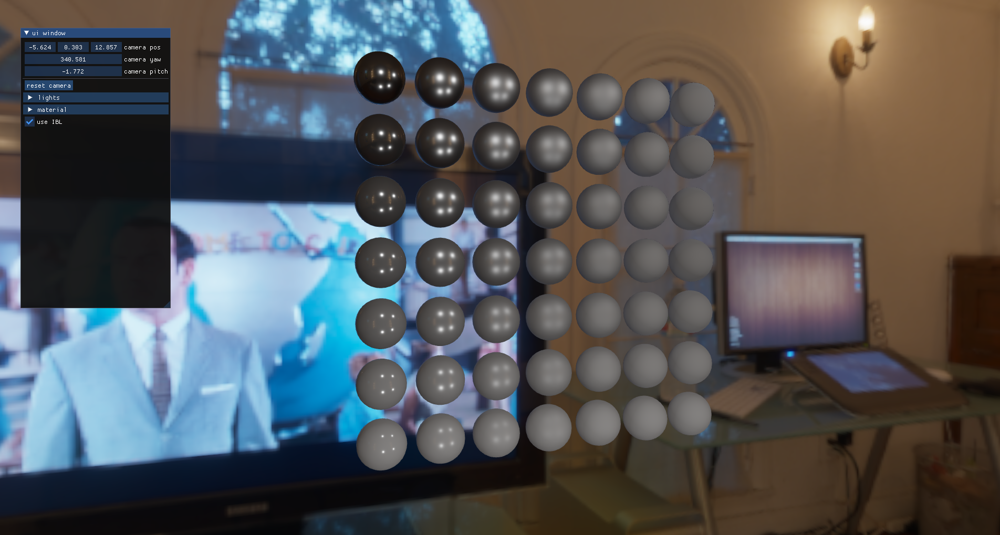

# cha_engine
------------
OpenGL을 기반으로 하여 기본적인 그래픽 요소들을 구현해보는 프로젝트입니다. 현재 구현한 내용은 다음과 같습니다.

+ Basic Components(Texturing, Camera Moving, Key Event, Object Loading etc...)
+ Basic UI to control components with Imgui
+ Cube Map
+ PBR(Physical Based Rendering)
+ IBL(Image Based Lighting)
  

구현해보았지만 코드 상으로 아직 깔끔하지 않아 포함하지 않은 요소들도 포함되어 있습니다.

+ Bloom
+ Shadow Mapping
+ Normal Mapping
+ Deferred Shading
+ SSAO

앞으로 구현하고자 하는 내용은 다음과 같습니다.

+ 3D 물리 충돌 시뮬레이션
+ PBD를 활용한 충돌 구현
+ Fluid Simulation(SPH, Grid Based)

# Third-party libraries
-----------
+ GLFW(https://github.com/glfw/glfw) : multi-platform library for OpenGL
+ glad(https://github.com/Dav1dde/glad) : GL/GLES/EGL/GLX/WGL Loader-Generator
+ GLM(https://github.com/g-truc/glm) : C++ mathematics library for graphics software based on the OpenGL
+ Imgui(https://github.com/ocornut/imgui) : bloat-free graphical user interface library for C++
+ spdlog(https://github.com/gabime/spdlog.git) : Very fast, header-only/compiled, C++ logging library
+ stb(https://github.com/nothings/stb) : single-file public domain (or MIT licensed) libraries for C/C++
+ assimp(https://github.com/assimp/assimp) : import and export various 3d-model-formats including scene-post-processing to generate missing render data.

# Reference
------------
 + LearnOpengl(https://learnopengl.com)
 + OpenGL Course note(https://www.youtube.com/watch?v=kEAKvJKnvfA&list=PLvNHCGtd4kh_cYLKMP_E-jwF3YKpDP4hf)